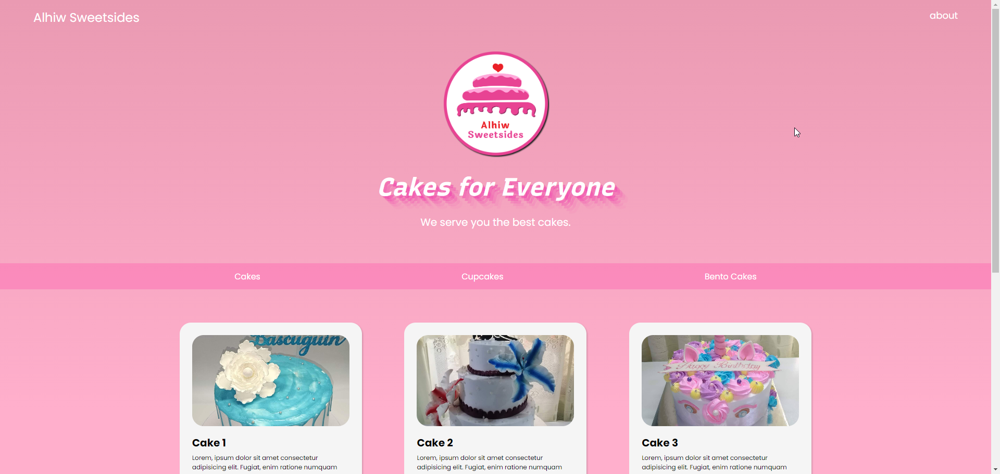
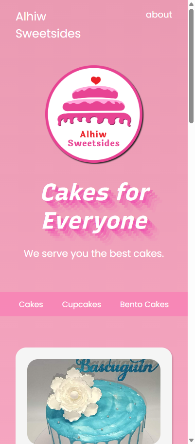

# Static Webpages

This repository contains a collection of static webpages built using only HTML and CSS. These webpages showcase various design layouts and styling techniques without any JavaScript or backend functionality.

### Preview

#### Web



#### Mobile View

<p align="center">

</p>

### Features

-   Pure HTML and CSS implementation

-   Responsive and modern web design

-   Well-structured and easy-to-understand code

-   Multiple page layouts

### How to run locally

1. Clone the Repository.

    To get a local copy up and running, run the following command:

    ```
    git clone https://github.com/kherzieandal/static_webpages.git
    ```

2. Open the `index.html` using your preferred web browser.

### Folder Structure

```

│-- assets/         # Directory for storing external assets
│   │-- images/     # Folder containing images used in the project
│-- index.html      # Main HTML file for the website
│-- README.md       # Documentation file with project details
│-- styles.css      # Main CSS file for styling the webpages

```
